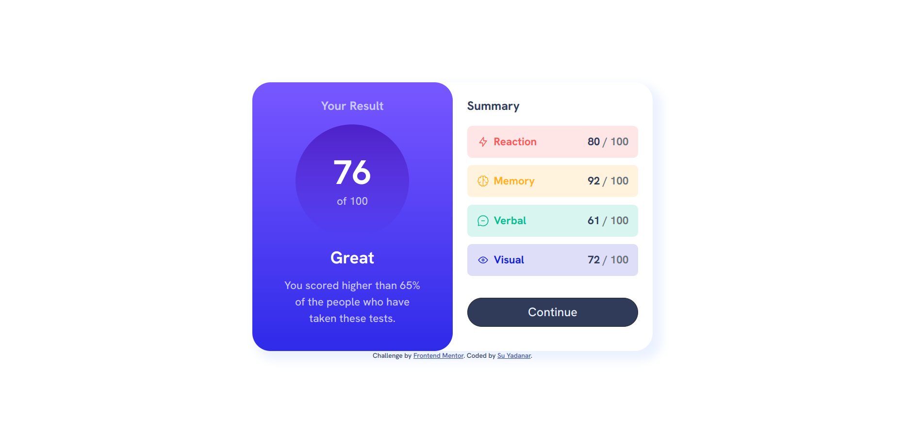
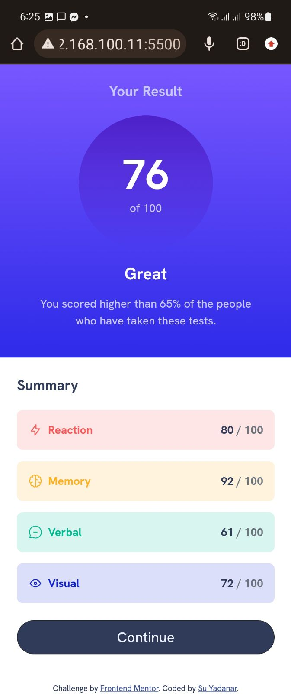

# Frontend Mentor - Results summary component solution

This is a solution to the [Results summary component challenge on Frontend Mentor](https://www.frontendmentor.io/challenges/results-summary-component-CE_K6s0maV). Frontend Mentor challenges help you improve your coding skills by building realistic projects. 

## Table of contents

- [Overview](#overview)
  - [The challenge](#the-challenge)
  - [Screenshot](#screenshot)
  - [Links](#links)
- [My process](#my-process)
  - [Built with](#built-with)
  - [What I learned](#what-i-learned)
  - [Continued development](#continued-development)
  - [Useful resources](#useful-resources)
- [Author](#author)
- [Acknowledgments](#acknowledgments)

## Overview

### The challenge

Users should be able to:

- View the optimal layout for the interface depending on their device's screen size
- See hover and focus states for all interactive elements on the page
- **Bonus**: Use the local JSON data to dynamically populate the content

### Screenshot

### Links

- Solution URL: [Click Me!](https://github.com/SYadanar/results-summary-component-main)
- Live Site URL: [Click Me!](https://results-summary-component-main-neon.vercel.app/)

## My process

### Built with

- HTML5
- CSS custom properties
- Bootstrap 5.2.3
- CSS Grid
- Javascript

### What I learned

From this challenge, I've learnt how to fetch JSON data and use it to generate dynamic Elements using Javascript.

### Useful resources

- [Read JSON file in Javascript](https://www.freecodecamp.org/news/how-to-read-json-file-in-javascript/)
- [Javascript Cheatsheets](https://www.codecademy.com/learn/fscp-building-interactive-websites-with-javascript/modules/fecp-javascript-and-the-dom/cheatsheet)

## Author

- GitHub - [SYadanar](https://github.com/SYadanar)
- Frontend Mentor - [@SYadanar](https://www.frontendmentor.io/profile/SYadanar)
